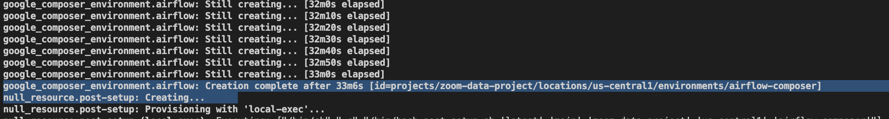
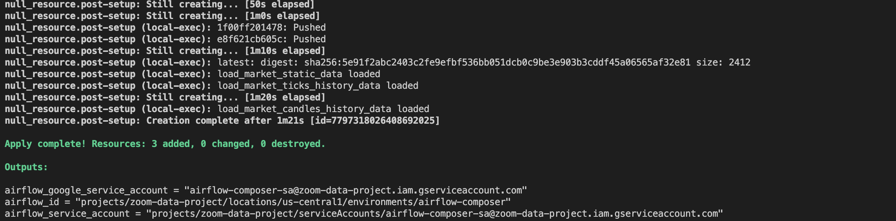
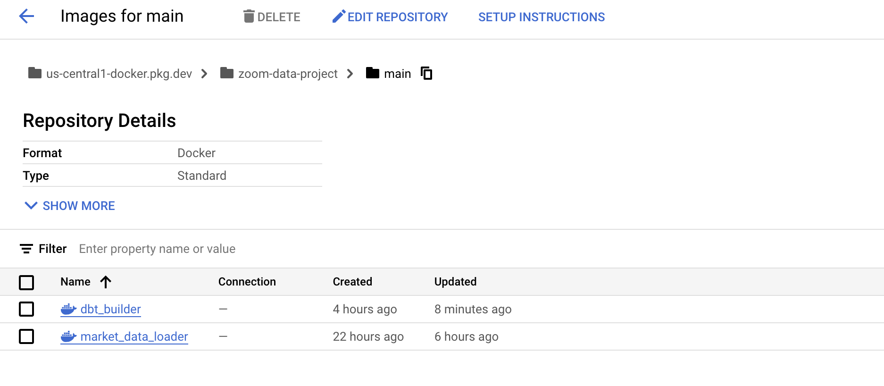
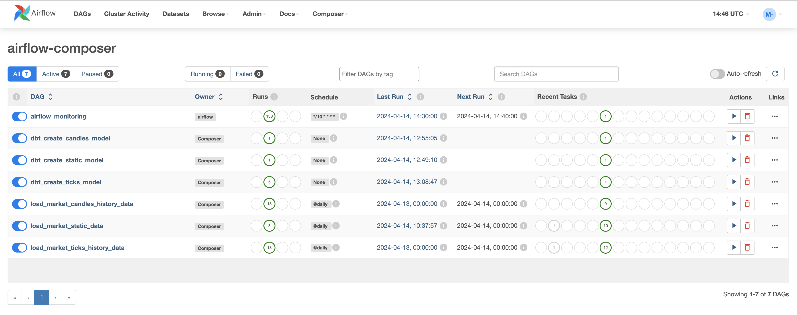
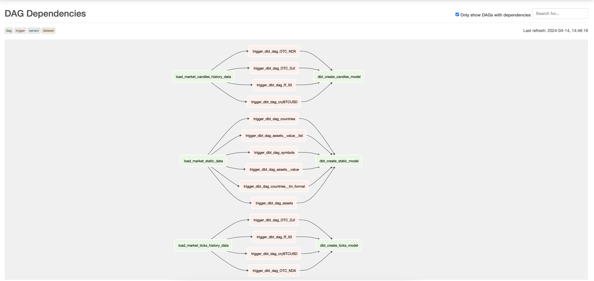
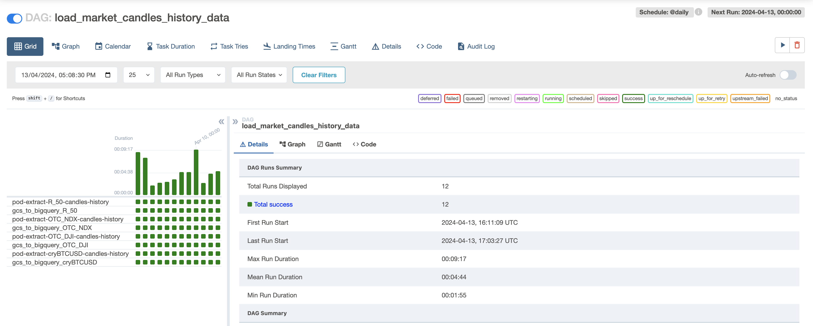
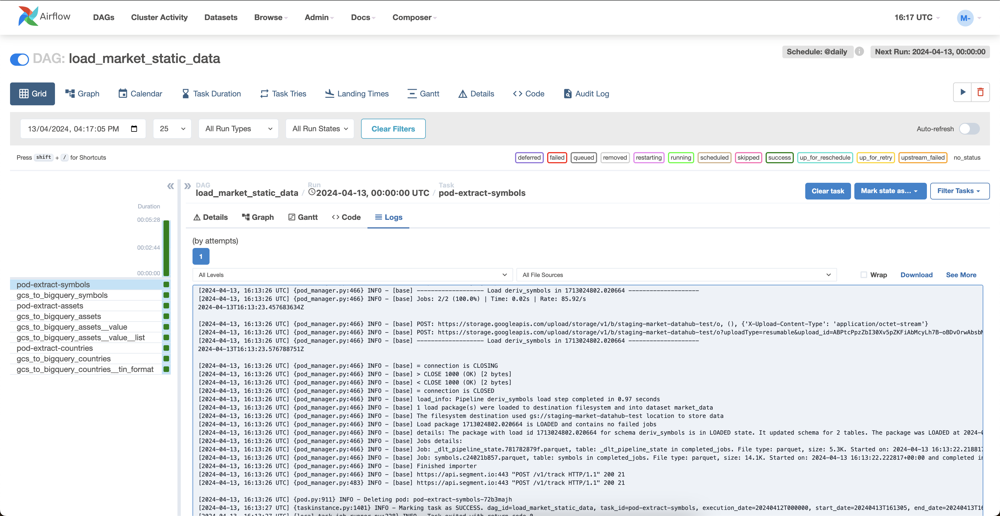
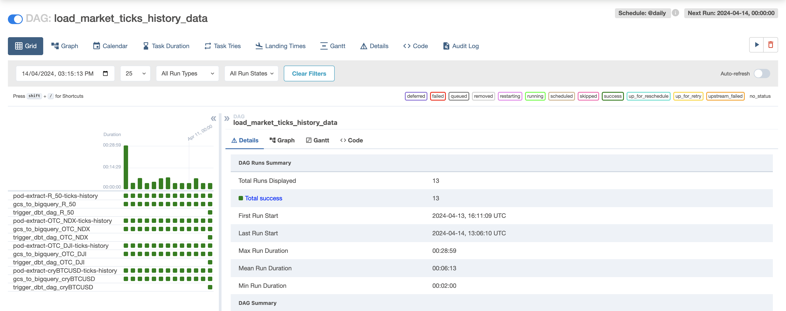
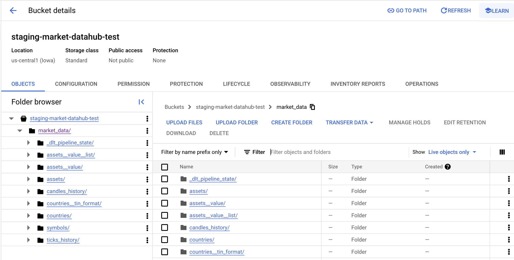
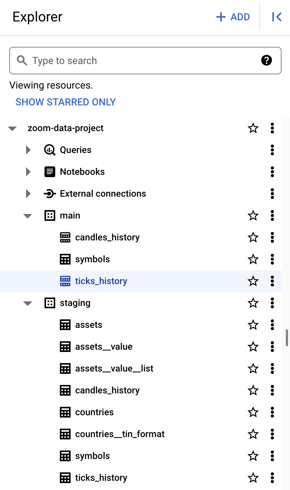

# Architecture

- [Architecture](#architecture)
  - [Tools and Technologies](#tools-and-technologies)
  - [Architecture](#architecture-1)
  - [Demo](#demo)
    - [Terraform](#terraform)
    - [Artifacts Registry (Docker Image)](#artifacts-registry-docker-image)
    - [Airflow (Google Cloud Composer)](#airflow-google-cloud-composer)
    - [Data Lake](#data-lake)
    - [Google BigQuery (BQ)](#google-bigquery-bq)
    - [Google Looker Studio](#google-looker-studio)

## Tools and Technologies

1- Cloud Services

- Google Cloud Platform (GCP)
- Terraform (IaC)
- `local-exec` provisioner (for running local scripts to fully automate the setup)

2- Data Extraction and Ingestion:

- WebSocket API
- Deriv API
- Artifacts Registry (Docker Image)
- DLT (Data Load Tool)

3- Data Lake:

- Google Cloud Storage (GCS)

4- Data Warehousing:

- Google BigQuery (BQ)

5- Data Transformations and Processing:

- Airflow (Google Cloud Composer)

6- Orchestration and Automation:

- Airflow (Google Cloud Composer)
- KubernetesPodOperator
- GCSToBigQueryOperator

7- Dashboard and Visualization:

- Google Looker Studio
- Check the dashboard [here](https://lookerstudio.google.com/u/0/reporting/f8385142-a03e-4f74-8bad-37ddc1cf4cc1/page/tEnnC).

## Architecture

TODO: add Architecture diagram

## Demo

### Terraform

### Artifacts Registry (Docker Image)

### Airflow (Google Cloud Composer)

### Data Lake

### Google BigQuery (BQ)

### Google Looker Studio

Check the dashboard [here](https://lookerstudio.google.com/u/0/reporting/f8385142-a03e-4f74-8bad-37ddc1cf4cc1/page/tEnnC).
